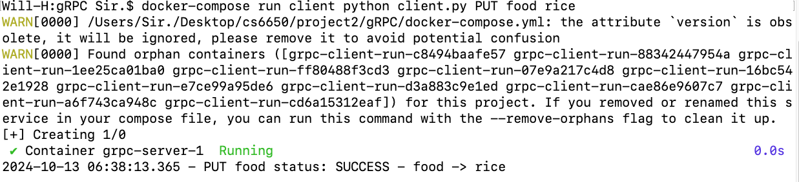

# gRPC Key-Value Store

This project implements a simple key-value store using gRPC in Python. The server handles concurrent requests from clients using RPC. It supports basic operations such as PUT, GET, and DELETE.


## Requirements

- Docker
- Docker Compose


## Usage

### Directly Build and Run the Docker

To build and run the Docker containers for the gRPC server and client, execute the following command in the terminal:

```bash
docker-compose up --build
```
Your terminal shall start up both server and client with prepopulated actions.

If you want to try customized KEYs and VALUEs, follow the below command

```bash
docker-compose run client python client.py PUT food rice
docker-compose run client python client.py GET food
docker-compose run client python client.py DELETE food
```

## Context
Both `key_value_store_pb2_grpc.py` and `key_value_store_pb2.py` are generated from the `key_value_store.proto` based on the following command. You need `pip` and all the dependencies from the `requirements.txt`
```bash
python -m grpc_tools.protoc -I=. --python_out=./server --grpc_python_out=./server key_value_store.proto
python -m grpc_tools.protoc -I=. --python_out=./client --grpc_python_out=./client key_value_store.proto
```

## Running `docker-compose up --build`

## Running `docker-compose run client python client.py PUT food rice`



Author: Wenqiang Hu